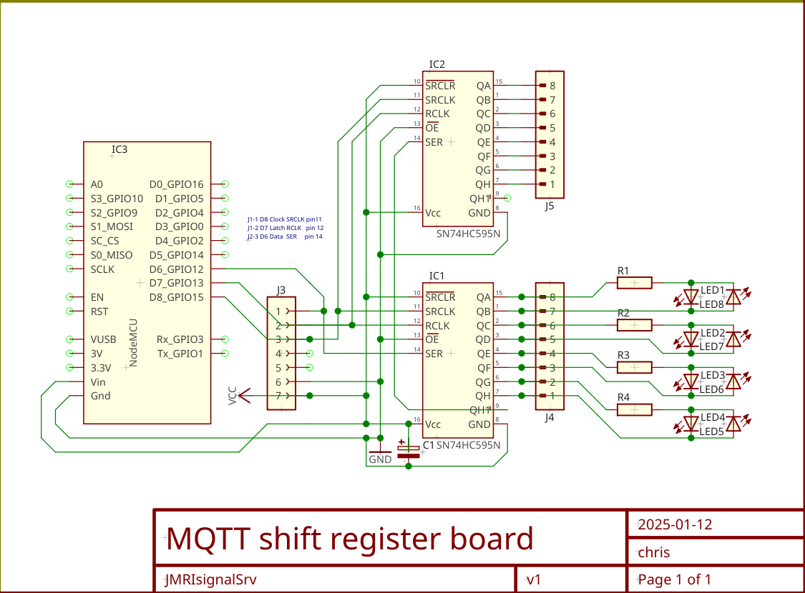

# ESP8266 signal server for JMRI
<div style="text-align: right"> <sup>Dec 2024</sub><br> </div>
This IOT server is build around an ESP8266 NodeMCU and a Serial In Parallel Out (SIPO) shift register to drive
Green/Red bi-polar LEDs for a model train layout that is controlled by
[JMRI](https://jmri.org "The JMRI project is building tools for model railroad computer control.").
<a href="https://jmri.org" title="The JMRI project is building tools for model railroad computer control.">JMRI</a>
<br>
<br>
The idea is by using a number of shift registers a variable number of signal lights can be controlled.
And with the use of bi-polar LEDs, the aspects green, yellow and red can be displayed prototypically with one head.
Also it's trying to mimic the dimming and brightening of incandescent light bulbs, to allow for older time period deployments.

This provides for a low cost signal controller for your layout.

Originally I created the following command messages to control the lights:
```
-t JMRI/signal/< light-n >/set -m < aspect >

with for aspect: GREEN | YELLOW | RED | FLASHINGGREEN | FLASHINGYELLOW | FLASHINGRED | DARK
And light-n for any name you want to give your light.
i.e. For turnout "Acton-main-A" to flash red would need commands:

-t JMRI/signal/Acton-main-A/set -m FLASHINGRED 
```
For now the configuration is done within the sketch code.
Since it's not expected to change much, I did not invest time in a web interface. And updates can be done Over The Air, so no need to disassemble the setup for updates.

After learning that JMRI only can turn lights ON or OFF, I've added the following commands:
```
-t JMRI/signal/light/set/< light-n >< -aspect > -m ON | OFF

aspects are now : green | yellow | red | flashing
i.e. For turnout "Acton-main-A" to flash red would now take two commands:

-t JMRI/signal/light/set/Acton-main-A-red -m ON
-t JMRI/signal/light/set/Acton-main-A-flashing -m ON
```

---
Schematic for connecting the shift-register

